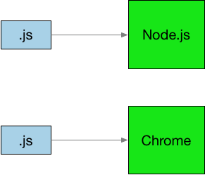

# Java Script Eco System
The goal of this document is to teach the reader about JavaScript and it’s eco system. I deliberately use the vague term eco system to prevent me having to precisely define the kinds of tools and techniques I am going to cover. While I might touch of some language features my goal is not to teach the reader how to program in JavaScript. Rather I intent to cover topic such as the following.

 * Where and how to execute JavaScript
 * How to debug JavaScript
 * How to use TypeScript to prevent
 * JavaScript modules
 * Developer tools

Each topic will be covered in a rather superficial manner. My goal is to show the user how to get a bare bones setup running and then, where appropriate, provide links to the relevant resources whether the user can find more depth. I am hence most aiming this article at professional developers who are used to using other languages and tools and who want to start using JavaScript.

## Execution Environments
JavaScript runs in a JavaScript execution engine. For the purposes of this document we will consider two commonly used execution environments 

 * Node.js commonly used for server side JavaScript
 * Chrome browser commonly used for client side JavaScript

<br/>



 To install Node.js see this [Link](https://nodejs.org/en). Most users will want the LTS version. To install Chrome see this [Link](https://www.google.com/intl/en_in/chrome/)

### Running Node.js in REPL
 Once we have installed Node.js we can test it out in REPL mode  (Read Execute Print Loop) by simply typing the following

 ```
 node
 ```

 and then entering some basic command such as follows

 ```
 PS C:\Users\kenne\code\kennyrnwilson\git\javascript-ecosystem> node
 Welcome to Node.js v16.16.0.
Type ".help" for more information.
> console.log("Hello World");
Hello World
undefined
>
 ```

### Chrome dev tools
Open Chrome and then enter Chrome dev tools using the key combination **Ctrl-Shift-I**. Move to the console tab and enter

```
console.log("Hello World");
```

## Basic Client Server and debugging
We will use a very simple client server example that we can build out in order to elucidate various tools and features. The basic client-server logic is [here](./code/basic-client-server/README.MD). In this introductory section I also show how to perform basic JavaScript debugging using Visual Studio Code of both Server Side and Front End logic. 

## JavaScript Modules
In this section I introduce JavaScript modules and show the basic usages of the modern ecma script module format. I also very briefly cover the old CommonJS modules.[here](./code/javascript-module-formats/README.MD)

