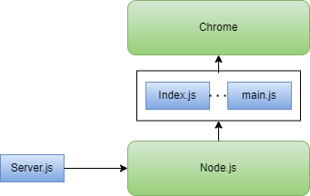

# Basic Client Server Example

The basic Client/Server example I will build out in subsequent sections. The basic structure of the project is as follows

## Project Structure
 We have an [Express](https://expressjs.com/) based server that can serve up our front end application which lives in the app folder. 

- Server.js
  - app
    - index.html
    - main.js

At runtime we have something that looks a bit like this.

</br>



### Server.js
The [Server.js](./Server.js) uses Express.js

```js
const express = require('express')
const app = express()
const port = 3000

// Log all incoming request to the console
const logRequest= (req, res, next) => {
  console.info(`${req.method} ${req.originalUrl}`)
  next()
}
app.use(logRequest)

// Setup static file serving from app directory. Use Index.html as root page
app.use(express.static('app', {index: "Index.html"}), )

// Start listening
app.listen(port, () => {
  console.log(`Example app listening on port ${port}`)
})
```

### app
The application consists of a simple piece of html and a simple single javascript file that attaches itself as a listener on a button and performs a simple addition.

**[app/index.html](./app/index.html)**

```html
<!DOCTYPE html>
<html lang="en-US">
  <head>
    <meta charset="utf-8">
    <title>Basic JavaScript module example</title>
    <script defer src="main.js"></script>
  </head>
  <body>
    <label for="fname">X:</label>
    <input type="text" id="x" name="x" value="2"><br><br>
    <label for="lname">Y:</label>
    <input type="text" id="y" value="3" name="y"><br><br>
    <input type="submit" value="Submit" id="submit">  
    <div id="result"></div></dev>
  </body>
</html>
```

**[app/main.js](./app/main.js)**
```js
let x = document.getElementById('x');
let y = document.getElementById('y');
let button = document.getElementById('submit');

button.addEventListener('click', clickHandler);

let r = document.getElementById('result');

function clickHandler(event) {
   let xv = Number(x.value)
   let yv = Number(y.value);
   
    r.innerHTML = `result is ${xv+yv}` ;
}
```
## Debugging 
IDEs tend to make the debugging process a little magical and opaque. In this section we try to cut throught the magic and how to manually set up some debugging. Once we understand how it works we can setup some visual studio logic to automate the process.

We now show how to debug the server and debug the client. 