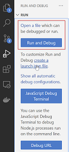

# Basic Client Server Example

The basic Client/Server example I will build out in subsequent sections. The basic structure of the project is as follows

## Project Structure
 We have an [Express](https://expressjs.com/) based server that can serve up our front end application which lives in the app folder. 

- Server.js
  - app
    - index.html
    - main.js

At runtime we have something that looks a bit like this.

</br>


### Server.js
The [Server.js](./Server.js) uses Express.js

```js
const express = require('express')
const app = express()
const port = 3000

// Log all incoming request to the console
const logRequest= (req, res, next) => {
  console.info(`${req.method} ${req.originalUrl}`)
  next()
}
app.use(logRequest)

// Setup static file serving from app directory. Use Index.html as root page
app.use(express.static('app', {index: "Index.html"}), )

// Start listening
app.listen(port, () => {
  console.log(`Example app listening on port ${port}`)
})
```

### app
The application consists of a simple piece of html and a simple single javascript file that attaches itself as a listener on a button and performs a simple addition.

**[app/index.html](./app/index.html)**

```html
<!DOCTYPE html>
<html lang="en-US">
  <head>
    <meta charset="utf-8">
    <title>Basic JavaScript module example</title>
    <script defer src="main.js"></script>
  </head>
  <body>
    <label for="fname">X:</label>
    <input type="text" id="x" name="x" value="2"><br><br>
    <label for="lname">Y:</label>
    <input type="text" id="y" value="3" name="y"><br><br>
    <input type="submit" value="Submit" id="submit">  
    <div id="result"></div></dev>
  </body>
</html>
```

**[app/main.js](./app/main.js)**
```js
let x = document.getElementById('x');
let y = document.getElementById('y');
let button = document.getElementById('submit');

button.addEventListener('click', clickHandler);

let r = document.getElementById('result');

function clickHandler(event) {
   let xv = Number(x.value)
   let yv = Number(y.value);
   
    r.innerHTML = `result is ${xv+yv}` ;
}
```

## Running the application
We start the server very simply using the following command.

```
node Server.js
```

or by using the command 

```
npm start
```

We then load the client using the URL

http://localhost:3000


## Debugging 
IDEs tend to make the debugging process a little magical and opaque. In this section we try to cut throught the magic by explicitly setting up a process for debug. Debugging involves a process that runs with debug server support and a debug client that connects to the server and controls it. 


> **Note:** In this context debug server does not mean a server side process. It can be a front-end or a back-end process. 

We consider four debug scenarios in this document.

 * Simple Launch and Debug Server Side Process
 * Launch and Attach to Server Side process
 * Attach to Front End process 
 * Launch and Attach front end process.

 We use Visual Studio Code as our debugger. For more details see [Debugging](https://code.visualstudio.com/Docs/editor/debugging)

Let us consider each of the four scenarios in turn.

### Simple Launch and Attach to Server Side process
Visual Studio Code comes with a very simple way of debuggigng Java Script node processes. If we click the **Run and Debug** icon in the  **Activity Bar** 


We see the **Run and Debug View** It is the first option we are interested in.



Open the [./Server.js](./Server.js) file and press the blue **Run and Debug** button. Visual studio will not launch Server.js in node with debug server support and attach itself as the debug client. You should see the debug options floating. Put a breakpoint on line 7.


Now open the link. You should hit the breakpoint.

[http://localhost:3000/](http://localhost:3000/)


### Attach to Server Side process
In our case the debug server process is our Node.js process running the Server.js file

<br/>


This will open the **Run and Debug View** The first time we do this it should look as follows. 

To enable debug support we start Node.js with a special --inspect flag

```
node --inspect Server.js
```
We now see the following output in the terminal

```
Debugger listening on ws://127.0.0.1:9229/a1a276e6-0a0c-497d-9949-ae3ab179b9a5
For help, see: https://nodejs.org/en/docs/inspector
Example app listening on port 3000
```

Now that we have a node process running with debug server support the next step is to get Visual Studio Code to create a debug configuration that can be used to attach to the process. We click the **Run and Debug** icon in the  **Activity Bar** 


We then can attach Visual Studio Code as the debug client by making sure Server.js is loaded in Visual Studio Code and has the focus. Now select the debug tab on the left (play button with bug) and then choose **create a launch.json file**

<br/>


Now select **Node.js**

We actually want a target that enables us to attach to our process running with debug server so beside the play button select **Add Configuration** and then **Node.js attach**

Your .vscode/launch.json should look like this

```json
{
    "version": "0.2.0",
    "configurations": [
        {
            "name": "Attach",
            "port": 9229,
            "request": "attach",
            "skipFiles": [
                "<node_internals>/**"
            ],
            "type": "node"
        }
    ]
}
```

Now if we put a break point on line 7 of [Server.js](./Server.js) and reload http://localhost:3000 we should hit the break point.

### Launch Server Process and Debug
We can use a launch target to run the process with debug and attach Visual Studio code as the debug client in one step as follows. We add a Launch Node.js debug configuration. Now we should have a section in .vscode/launch.json that looks like this 

```json
        {
            "name": "Launch Program",
            "program": "${workspaceFolder}/app.js",
            "request": "launch",
            "skipFiles": [
                "<node_internals>/**"
            ],
            "type": "node"
        },
```

Our process is Server.js and not app.js so we need to modify it to

```json
        {
            "name": "Launch Program",
            "program": "${workspaceFolder}/Server.js",
            "request": "launch",
            "skipFiles": [
                "<node_internals>/**"
            ],
            "type": "node"
        },
```
Again by reloading the site we hit the break point.

### Debug the client app in Chrome using chroms as debug client

### Debug the client app in Chrome using Visual Studio Code as debug client
