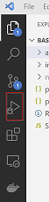
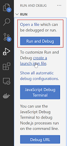
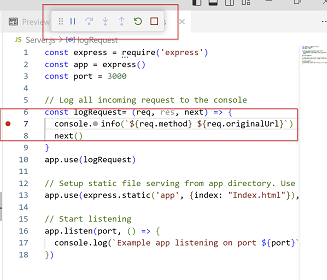
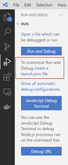
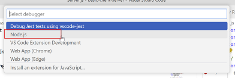
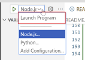
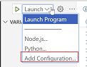
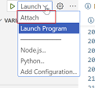
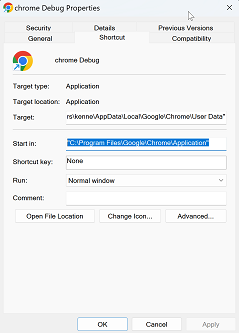
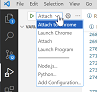

# Basic JavaScript Debugging

IDEs tend to make the debugging process a little magical and opaque. In this section I will cut throught the magic by explicitly setting up a process for debug. Debugging involves a process that runs with *debug server support* and a debug client that connects to the server and controls it. 


> **Note:** In this context debug server does not mean a server side process. It can be a front-end or a back-end process. 
We consider four debug scenarios in this document.

 * Simple Launch and Debug Server Side Process
 * Launch and Debug Server Side process (Configured)
 * Attach to Server Side Process
 * Launch and Attach front end process.
 * Attach to Front End process 


 We use Visual Studio Code as our debugger. For more details see [Debugging](https://code.visualstudio.com/Docs/editor/debugging)

Let us consider each of the four scenarios in turn.

## Simple Launch and Attach to Server Side process
Visual Studio Code comes with a very simple way of debugging JavaScript node processes. If we click the **Run and Debug** icon in the  **Activity Bar** 



We see the **Run and Debug View** It is the first option we are interested in. 



Open the [./Server.js](./Server.js) file and press the blue **Run and Debug** button. Visual Studio Code will ask you to select a debugger. Enter **Node.js**. Visual studio will now launch Server.js in node with debug server support and attach itself as the debug client. You should see the debug options floating. Put a breakpoint on line 7.



Now open the link. You should hit the breakpoint.

[http://localhost:3000/](http://localhost:3000/)


## Launch and Debug Server Side process (Configured)
Often we want to create a more complex debug configuration. To do this click the **Run and Debug** icon in the  **Activity Bar**  and select **create a launch.json file** 



Now select **Node.js**



If we press the Node.js option while our focus is in Server.js Visual Studio Code will create a file called launch.json in a folder called .vscode. Inside the launch.json it will add a configuration to launch our Server.js file which looks as follows. 

```json
{
    // Use IntelliSense to learn about possible attributes.
    // Hover to view descriptions of existing attributes.
    // For more information, visit: https://go.microsoft.com/fwlink/?linkid=830387
    "version": "0.2.0",
    "configurations": [
        {
            "type": "node",
            "request": "launch",
            "name": "Launch Program",
            "skipFiles": [
                "<node_internals>/**"
            ],
            "program": "${workspaceFolder}\\Server.js"
        }
    ]
}
```

Now if we should notice that we have a target with name "Launch Program" in the drop down



If we add a breakpoint on line 7 of Server.js, press this "Launch Program" button and then reload the client we should once again hit out break point.

[http://localhost:3000/](http://localhost:3000/)


## Attach to Server Side Process
We can start our server process on the command line with debug support by passing the --inspect flag to Node.js

To enable debug support we start Node.js with a special --inspect flag

```
node --inspect Server.js
```

```
Debugger listening on ws://127.0.0.1:9229/a1a276e6-0a0c-497d-9949-ae3ab179b9a5
For help, see: https://nodejs.org/en/docs/inspector
Example app listening on port 3000
```

Now that we have a node process running with debug server support, the next step is to get Visual Studio Code to create a debug configuration that can be used to attach to the process. We can add a configuration for this as follows.



Choose **Node.js: attach** 

Visual Studio will add another section to the launch.json file that looks as follows.

```json
          {
            "name": "Attach",
            "port": 9229,
            "request": "attach",
            "skipFiles": [
                "<node_internals>/**"
            ],
            "type": "node"
        }
``` 

Now we can attach to the running process by using this option in the drop down.



Once again reload the link [http://localhost:3000/](http://localhost:3000/) and we should hit our break point.

## Launch and Attach front end process.
Until now all out debug examples have centered around debugging the server. Let us now consider debugging the front end process. Once again we select **Add Configuration**


and this time we choose **Chrome: Launch**. VS Code will add a section as follows to launch.json

```json
        {
            "name": "Launch Chrome",
            "request": "launch",
            "type": "chrome",
            "url": "http://localhost:8080",
            "webRoot": "${workspaceFolder}"
        }
```

We need to modify this a bit as the default url is wrong. We change it to

**"url": "http://localhost:3000",**

Our application also lives in a subfolder of the workspace called app so we modify this too

**"webRoot": "${workspaceFolder}\\app"**

The modified configuration looks as follows. 

```js
        {
            "name": "Launch Chrome",
            "request": "launch",
            "type": "chrome",
            "url": "http://localhost:3000",
            "webRoot": "${workspaceFolder}\\app"
        }
```

Put a breakpoint on line 5 of [main.js](./app/main.js) and press press play with "Launch Chrome" selected. Visual Studio code will launch Chrome with debug enabled and attach itself as the debugger. It will then hit the break point on line 5.

## Attach to Front End process 
Attaching to Chrome is a little more involved. We need to start chrome with special debug arguments. To do this we need to add a shortcut. On my machine the Chrome executable is as follows.

**"C:\Program Files\Google\Chrome\Application\chrome.exe"**


Rather more bizarely we also need to know the location of the Chrome user data directory. Usually on Windows this is as follows. Replace <username> with your username


**"C:\Users\<username>\AppData\Local\Google\Chrome\User Data"**

Create the shortcut as follows. The Target should be as follows. Replace the exe path and user data file as needed.

"C:\Program Files\Google\Chrome\Application\chrome.exe" --remote-debugging-port=9222 --user-data-dir="C:\Users\<username>\AppData\Local\Google\Chrome\User Data"



Close all existing instances of Chrome and launch a single Chrome using the new shortcut. Open the URL http://localhost:3000 and add a debug break on line 10. 

Now attach Visual Studio Code using the Attach Chrome configuration



If you click the add button on your front end application you should hit the break point.

## References 
|Resource|
:--|
[Visual Studio Debugging](https://code.visualstudio.com/Docs/editor/debugging)
