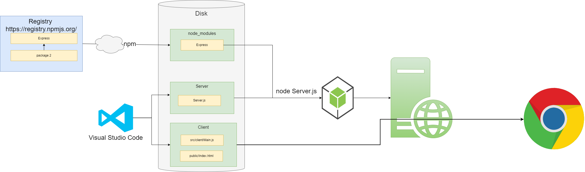

# The Basic Development and Execution Environment


This section introduces the basics of JavaScript development. In it I will cover execution in a browser and in Node.js. I will also cover the npm package manager.

## Prerequisites
Any basic development environment needs at the very least 

 1. A code editor such as [Visual Studio Code](../../tools/vscode.md)
 2. A package manager such as [Node Package Manager(npm)](../../tools/node-package-manager.md)
 3. [Node.js]((https://nodejs.org/en))

## Creating the Code
Because this simple project uses pure JavaScript our **tool chain** has no compile step. The source code is the code we pass to the JavaScript execution engine such as Chrome or Node.js. Our code consists of two components.

 1. Server to serve up files 
 2. App to execute in a browser. 

 The code will be structured as follows.

 ### Source Code Structure**

  * public 
    * index.html
  * src
    * client
      * Main.js
    * server
      * Server.js

## Creating the package

We use npm to create a package.json file. 

```
npm init --yes
```

  For my notes on npm see [NPM](../../tools/node-package-manager.md). For more details on package.json see

* [package.json](https://docs.npmjs.com/cli/v9/configuring-npm/package-json)
* [The basics of package.json](https://nodesource.com/blog/the-basics-of-package-json/#:~:text=The%20package.,modules%2C%20packages%2C%20and%20more.)

## Creating the Server Component 
### Add the express.js package
Our server application will use the [Express.js](https://expressjs.com/) framework. We install the express package using the npm command.

```
npm install express
```
### Create Server.js
Create the file [server/src/Server.js](./server/src/Server.js) as follows.

```js
const express = require('express');
const app = express();
const port = 3000;

// Log all incoming request to the console
const logRequest= (req, res, next) => {
  console.info(`${req.method} ${req.originalUrl}`);
  next();
}
app.use(logRequest);

// Setup static file serving from app directory. Use Index.html as root page
app.use(express.static('app', {index: "Index.html"}), );

// Setup static file serving from app/src for the JavaScript files.
app.use(express.static('app/src'));

// Start listening
app.listen(port, () => {
  console.log(`Example app listening on port ${port}`);
});
```

### Run the Server.js

```
node server/src/Server.js
```

## Creating the Client Component
The first part of our client app is the root html file. Add the file [Index.html](./app/Index.html)

``` html
<!DOCTYPE html>
<html lang="en-US">
  <head>
    <meta charset="utf-8">
    <title>Basic JavaScript module example</title>
    <script defer src="Main.js"></script>
  </head>
  <body>
    <input type="submit" value="Click Me" id="button">  
    <div id="result"></div>
  </body>
</html>
```

> **Note:** When we add the JavaScript file we dont put the full path 'src/Main.js' because when we setup the Server we told it how to resolve the paht by adding  **app.use(express.static('app/src'));** 

### Running the Client App
Open the following link

[Client App](http://localhost:3000)

Now we have a fully functioning client ans server. Note that when we open the client app the Server.js logs out all requests and the client asks for the Index.html and the Main.js

```
GET /
GET /Main.js
```

## More About Package.json
We can add *scripts* to package.json. We can then call these from npm. I have added the following. 

```json
  "scripts" : {
    "start" : "node server/src/Server.js"
  },
```

Now I can run the server using.

```
npm run start
```

In the special case of a script called start we can ommit the run and just use.

```
npm start
```