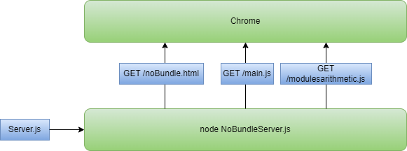
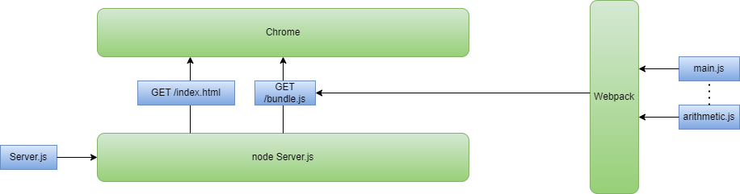
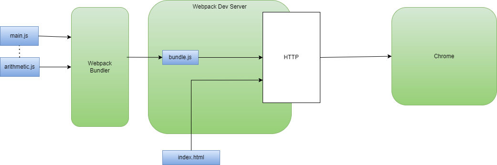

# Webpack and hot reloading Client

Up until now I have been using an Express.js web server to serve up the front end. This has its limitations. 

1. It is hard to make hot reload work
2. Every file needed is served up separately. 
 
Webpack solves these problems for us. To see this consider the situation without webpack. I have created an express server called [NoBundleServer.js](./NoBundleServer.js) This serves up the index file called [assets/noBundle.html](./assets/noBundle.html) which in turn requests [src/main.js](./src/main.js) which in turn requests [src/modules/arithmetic.js](./src/modules/arithmetic.js). This is a very simple example but you can imagine situations where this mode of operation would lead to hundreds if not thousands of requests. 



The second problem is that it is  difficult to get the hot reload feature to apply changes to client side when we change files. 

## Bundling
Lets look at solving the first problem using webpack. We setup a simple configuration file that looks as follow [webpack_basic.config.js](./webpack_basic.config.js)

```js
module.exports = {
    mode: "development",
    devtool: "inline-source-map",
    entry: "./src/main.js",
    output: { filename: "bundle.js" },    
    resolve: { extensions: [".js"] },
    module: {
        rules: []
    }
};

```

This tells webpack to start from ./src/main.js, walk the dependency tree and create a bundle.js file. We run it as follows. 

```
npx webpack --config .\webpack_basic.config.js
```

We then run it using 

```
node Server.js
```
We now have **bundled** all our javascript dependencies into one file. 



## Hot Load
The second great feature webpack gives us is hot reloading of the client code. We get this by adding webpack dev server. The new webpack config file is then [webpack.config.js](./webpack.config.js) and the key addition is 

```js
 devServer: {
        contentBase: "./assets",
        port: 4500
    }
```

If we do this then the bundle is never generated and webpack does everything in memory in its dev server. 

```
npx webpack serve --config .\webpack.config.js
```



## Debbuging
We can launch Chrome with debugging using the technique described in a previous section. We can then have debug with hot reload on the client using Webpack dev server.