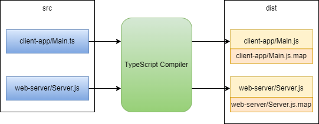

# Basic Client Server Example (TypeScript)

Adding [TypeScript](https://www.typescriptlang.org/) to a project enables one to catch a whole set of errors at compile type that might otherwise only be caught at runtime. The downside is that it also adds an extra compilation step that increases the complexity of our toolchain. I have restructured the source code folder from our basic JavaScript client-serer workspace [Basic JavaScript Client Server](../../basic-client-server/README.MD) to make it easier to have source TypeScript files in one folder and and compiled runnable JavaScript in another folder. 

Before we start we need to install the TypeScript compiler. 


```
npm i -g typescript 
```

## Workspace Structure

 * app
   * index.html
 * src
   * client-app
     * Main.ts
   * web-server
     * Server.ts 
 * dist

## Compilation
 And our tool chain will look as follows.

 


 We need to create a config file that tells the TypeScript compiler where to find the source files and where to put the output files (including other things)

**tsconfig.json**
```json
{
  "compilerOptions": {
    /* Visit https://aka.ms/tsconfig to read more about this file */

    "target": "es2016", /* Set the JavaScript language version for emitted JavaScript and include compatible library declarations. */
    "module": "commonjs", /* Specify what module code is generated. */
    "esModuleInterop": true, /* Emit additional JavaScript to ease support for importing CommonJS modules.
    "forceConsistentCasingInFileNames": true, /* Ensure that casing is correct in imports. */
    "strict": true, /* Enable all strict type-checking options. */
    "outDir": "./dist",
    "sourceMap": true
  }
}
```


In this workspace I modify the original client-server example to use TypeScript. The first thing I need to enhance is the Server.js file. Before we can do anything we need to first install the typescript compiler and the types needed for node and for express. 

```
npm i -dev typescript @types/express @types/node
```


This workspace introduces the basic Client/Server scenario I will out in subsequent sections.

 We use the [Express](https://expressjs.com/) web framework to create a simple [Server](./Server.js) that can serve up static HTML files. We use this server to serve up the files that constitute our front end application. The basic directory is as follows.
 
**Directory Structure**
- Server.js
- app
  - index.html
  - main.js

At runtime we have something that looks like this.
</br>

**Runtime**


## Installing Node dependencies
I will use the NPM package manager to install and manage node dependencies. To install express run

```
npm install express
```

We now take a quick look at the Server and the Font-End client application.
## Server.js
As mentioned the [Server.js](./Server.js) uses [Express](https://expressjs.com/) web framework. Lets take a look at our file bit by bit.

### Adding Express Module

The first line adds express module. We will cover the two forms of JavaScript modules in the next section. For now we just note that that syntax for brining in a dependency is the older CommonJS way as this is the default in Node.js 

```js
const express = require('express')
```

### Creating a Server Object

We then create an instance of the express web server by calling the *express()* function.

```js
const app = express()
```

### Getting Server to log  requests
We then register a piece of middleware that will log every request that comes into our server from the browser (or any other http client). This is useful for diagnostic purposes and for adding breakpoints when we cover the basics of JavaScript debugging.

```js
// Log all incoming request to the console
const logRequest= (req, res, next) => {
  console.info(`${req.method} ${req.originalUrl}`)
  next()
}
app.use(logRequest)
```

### Telling Server where to server from
We need to tell our Express server where to serve static files from. In our case all the files that constitute the front-end application are served from the **app** subfolder of the workspace. The *{index: "Index.html"}* syntax tells Express to serve up "Index.html* when a browser passes the root path */*.

```js
app.use(express.static('app', {index: "Index.html"}), )
```

#### Starting the Server listening
We need to tell the server to start listening for incoming requests from the browser. We need to pass in a port for this.

```js
app.listen(port, () => {
  console.log(`Example app listening on port ${port}`)
})
```
## app
The application consists of a simple piece of HTML and a simple single Javascript file that attaches itself as a listener on a button and performs a simple addition when clicked.

**[app/index.html](./app/index.html)**

```html
<!DOCTYPE html>
<html lang="en-US">
  <head>
    <meta charset="utf-8">
    <title>Basic JavaScript Client/Server</title>
    <script defer src="main.js"></script>
  </head>
  <body>
    <label for="fname">X:</label>
    <input type="text" id="x" name="x" value="2"><br><br>
    <label for="lname">Y:</label>
    <input type="text" id="y" value="3" name="y"><br><br>
    <input type="submit" value="Submit" id="submit">  
    <div id="result"></div></dev>
  </body>
</html>
```

**[app/main.js](./app/main.js)**
```js
let x = document.getElementById('x');
let y = document.getElementById('y');
let button = document.getElementById('submit');

button.addEventListener('click', clickHandler);

let r = document.getElementById('result');

function clickHandler(event) {
   let xv = Number(x.value)
   let yv = Number(y.value);
   
    r.innerHTML = `result is ${xv+yv}` ;
}
```

## Running the application
We start the server very simply using the following command.

```
node Server.js
```

or by using the command 

```
npm start
```

## Running the application
We then load the client using the URL

http://localhost:3000

## References 
|Resource|
:--|
[Node Package Manager](https://www.npmjs.com/)
[Express](https://expressjs.com/)
